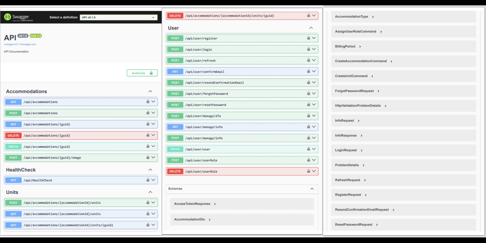

# Accommodations API

[](https://github.com/nkordis/accommodations-api/actions)
[](https://github.com/nkordis/accommodations-api/actions)

An API designed to dynamically manage and display accommodations listings.

<p align="center">
  
</p>

## Live URL
Access the live API documentation at: [https://accommodations-api.azurewebsites.net/api/swagger](https://accommodations-api.azurewebsites.net/api/swagger)

## Overview
This API allows you to dynamically manage and display accommodations listings. It is built with ASP.NET and follows Domain-Driven Design (DDD) principles.

## Features
- Create, modify, delete, and retrieve accommodations data.
- Authentication and authorization for API users.
- File handling for uploads and downloads.
- CI/CD pipelines for automated build and deployment.
- Logging with Serilog.
- Clean Architecture and CQRS patterns.

## Technologies
- C#
- ASP.NET Core
- Azure SQL Database
- Azure Web App
- DDD
- Clean Architecture
- CQRS
- Serilog
- Identity
- Entity Framework
- MediatR
- FluentValidation
- xUnit
- Moq

## Setup
To set up the project locally:
1. Clone the repository.
    ```sh
    git clone https://github.com/nkordis/accommodations-api.git
    ```
2. Navigate to the project directory.
    ```sh
    cd accommodations-api
    ```
3. Restore dependencies.
    ```sh
    dotnet restore
    ```
4. Build the project.
    ```sh
    dotnet build
    ```
5. Run the project.
    ```sh
    dotnet run
    ```

## Testing
To run the tests:
1. Navigate to the test project directory.
    ```sh
    cd tests/Accommodations.Tests
    ```
2. Run the tests using the .NET CLI.
    ```sh
    dotnet test
    ```

## Usage
Access the API documentation at `/api/swagger` once the application is running.

## Contributing
Contributions are welcome! Please fork the repository and create a pull request with your changes.

## License
This project is licensed under the MIT License.
